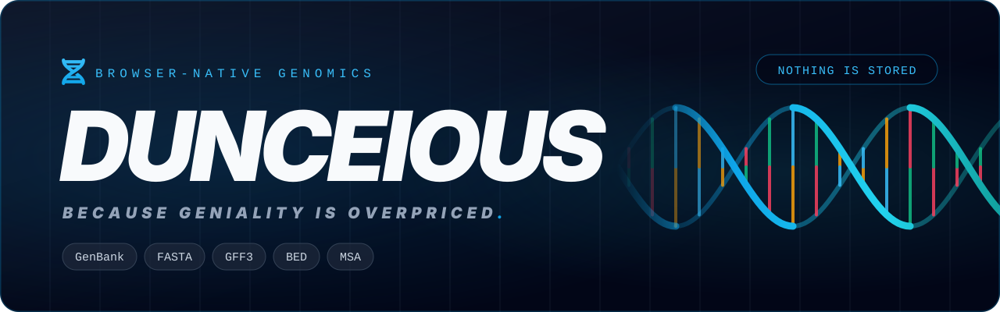

<div align="center">

<a href="https://dunceious.pages.dev/">
  
</a>

<p>
  <a href="https://github.com/JoaoVictorDaijo/dunceious/actions/workflows/ci.yml"></a>
  <a href="./CHANGELOG.md"></a>
  <a href="./COPYING"></a>
  <a href="https://dunceious.pages.dev/"></a>
  
</p>

**A browser-native workbench for GenBank, FASTA and multi-sequence alignments — parse, view, annotate and search without uploading a single base.**

*Because geniality is overpriced. Invest in coffee and staff, not in genial expensive software.*

[**Live demo**](https://dunceious.pages.dev/) · [User manual](./USER_MANUAL.md) · [Architecture](./ARCHITECTURE.md) · [Changelog](./CHANGELOG.md)

</div>

---

## About

Dunceious is a high-performance, browser-based bioinformatics platform for **Multi-Sequence Alignment (MSA) visualization**, annotation management and sequence analysis. It parses GenBank and FASTA files, overlays alignments you compute with your aligner of choice, renders an interactive genome viewer with semantic zoom, and provides both exact (IUPAC degenerate codes) and fuzzy (Smith-Waterman) sequence search — all without a backend.

For the full feature description see [`DOCUMENTATION.md`](./DOCUMENTATION.md), for usage instructions see [`USER_MANUAL.md`](./USER_MANUAL.md), and for the technical design see [`ARCHITECTURE.md`](./ARCHITECTURE.md).

## Features

- **GenBank & FASTA ingestion** — multi-record GenBank files (nucleotide and protein), batch FASTA upload, and automatic de-duplication of repeated IDs. Each workspace holds one molecule type (nucleotide or peptide), detected per record and enforced on every upload; RNA keeps its `U` residues.
- **Alignment** — two ways in, one pipeline. Upload a pre-aligned FASTA you computed yourself, or click **Align Sequences** to have [EMBL-EBI's Job Dispatcher](https://www.ebi.ac.uk/jdispatcher/) align the loaded records with MAFFT (the default), Kalign, Clustal Omega or MUSCLE, and overlay the result. The remote option is opt-in and asks for your explicit agreement first, because it sends your sequences to EMBL-EBI. Annotations are transposed into aligned coordinates and drawn as one continuous bar across gaps, and the conservation heatmap becomes available.
- **Semantic zoom viewer** — from mismatch density at low zoom, to individual bases, to amino-acid translations (frames F1–F3) over CDS features, honouring each CDS's genetic code. Virtualized rows, sticky sequence labels, and Pan / Select interaction modes.
- **Sequence search** — exact search with IUPAC degenerate codes for both nucleotide and peptide alphabets, and fuzzy Smith-Waterman local alignment (affine gaps, Gotoh) that also searches the reverse complement in nucleotide sessions. Turn hits into annotations from the results list.
- **Annotations & tracks** — merge `.gff` / `.bed` annotations into loaded records, render BED files as quantitative line or interval tracks, create and edit features (including circular ones), and manage every record and feature in the **Annotation Hub**.
- **Export** — FASTA (full alignment or selected region), GFF3, GenBank, a selection snapshot as JSON (0-based half-open intervals), or the whole workspace as a project JSON.
- **Private by design** — no backend and no third-party CDNs; parsing and search run in Web Workers on your own machine. The only exception is the optional remote alignment, which sends your sequences to EMBL-EBI only after you agree to it.

Sample GenBank / GenPept records for trying it out live in [`examples/`](./examples/README.md).

## Use Dunceious

**Everything runs locally in your browser.** Your sequences are parsed, viewed and searched entirely on your own machine — nothing is uploaded, and nothing is stored on any server. Dunceious has no backend.

**One opt-in exception: remote alignment.** If you choose **Align Sequences**, Dunceious first asks you to agree that your sequences (and a contact email) will leave your browser and be processed on EMBL-EBI's servers under its [privacy notice](https://www.ebi.ac.uk/jdispatcher/assets/html/privacy-notice.pdf) and [terms of use](https://www.ebi.ac.uk/about/terms-of-use/). Until you agree, nothing is sent. The agreement lasts only while the page stays open: a refresh, a closed and reopened page, or a new tab asks again, and you can revoke it at any time. Aligning with your own tool and uploading the pre-aligned FASTA keeps everything local.

You can use it two ways:

1. **Online, no install** — open **[dunceious.pages.dev](https://dunceious.pages.dev/)**. The app is fully static and self-contained (no third-party CDNs), so every file you open stays on your device. It is hosted on Cloudflare Pages purely as static files — the hosting only serves the app; it never sees your data.
2. **Run it locally** — prefer to run it yourself, work offline, or hack on the code? Build and serve it locally; see [Quick start](#quick-start) below.

## Quick start

### Prerequisites

| Requirement                    | Minimum version              |
| ------------------------------ | ---------------------------- |
| [Node.js](https://nodejs.org/) | **20.19** (or **22.12+**)    |
| npm                            | Ships with Node.js           |

> **Why Node.js 20.19?** The app itself builds with Vite 6 and React 19, but the development toolchain (`@vitejs/plugin-react` 5, ESLint 10, Vitest 4, jsdom 29) declares `node: ^20.19.0 || >=22.12.0`. CI runs on Node.js 20.

There are many ways to install Node.js, but we recommend **NVM (Node Version Manager)** as it lets you install and switch between Node versions without touching your system install. Use [nvm](https://github.com/nvm-sh/nvm) on Linux and macOS, or [nvm-windows](https://github.com/coreybutler/nvm-windows) on Windows. Once NVM is installed, `nvm install --lts` installs the latest LTS release of Node.js with npm bundled — that single command is everything you need to install and run Dunceious.

### Install and run

```bash
git clone https://github.com/JoaoVictorDaijo/dunceious.git
cd dunceious
npm ci          # install the exact dependency tree from package-lock.json
npm run dev     # start the dev server
```

The app will be available at **http://localhost:3000**. The dev server supports hot-module replacement (HMR), so your changes are reflected instantly.

### Available scripts

| Command                 | What it does                                                                                                                          |
| ----------------------- | ------------------------------------------------------------------------------------------------------------------------------------- |
| `npm run dev`           | Start the Vite development server on port 3000                                                                                        |
| `npm run build`         | Bundle the app for production with Vite — catches bundling errors, but **not** type errors (use `npm run typecheck` for those)          |
| `npm run preview`       | Serve the last `npm run build` output locally — useful for testing a built artifact                                                   |
| `npm run typecheck`     | Type-check the codebase with `tsc --noEmit` — no output means no type errors                                                          |
| `npm run lint`          | Run ESLint over the codebase (`eslint .`) — exits non-zero on lint errors (warnings are allowed)                                       |
| `npm run lint:headers`  | Check that every covered source file starts with the AGPL license header                                                              |
| `npm test`              | Run the unit test suite (excludes benchmarks)                                                                                         |
| `npm run test:coverage` | Run the unit test suite with v8 coverage and the coverage-ratchet thresholds (what CI runs)                                           |
| `npm run perf`          | Run the performance regression guardrails in `perf/` — absolute + relative time/memory budgets on core algorithms (console only)       |
| `npm run bench`         | Run the GenBank parse-time data grid in `bench/` and write results to `bench/results/benchmark.json` + SVG plots to `bench/plots/`     |
| `npm run plot`          | Regenerate the SVG plots in `bench/plots/` from an existing `bench/results/benchmark.json` without re-running the grid                  |

## Tech stack

- **React 19** — UI framework (Hooks-based, no class components)
- **TypeScript 5** — type-checked with `tsc --noEmit` (`strictNullChecks` enabled)
- **Vite 6** — build tool and dev server
- **D3.js 7** — coordinate scaling and SVG rendering
- **react-window** — virtualized list rendering for large sequence sets
- **Web Workers** — file parsing and sequence search off the main thread, behind typed message contracts
- **Tailwind CSS** — utility-first styling, compiled at build time (self-hosted, no CDN)
- **Font Awesome 6** — icon set (self-hosted, no CDN)
- **Inter & JetBrains Mono** — UI and monospace typefaces (self-hosted, no CDN)
- **Vitest + Testing Library** — unit, component and canvas render tests

## Project layout

```text
src/
├── domain/   pure biology model and algorithms (coordinates, consensus, intervals, sequence)
├── core/     format parsers/serializers (GenBank, FASTA, GFF/BED) and search
├── workers/  thin worker shells, typed protocol, and handler bodies
└── app/      the React application: components, hooks, viewer
```

Imports only point **down** the stack `domain ← core ← workers ← app`, enforced by ESLint. [`ARCHITECTURE.md`](./ARCHITECTURE.md) is the canonical reference for the layers, worker contracts and where new code goes. Benchmarks live in `bench/`, performance guardrails in `perf/`, and sample data in `examples/`.

## Contributing

1. Open pull requests against `develop`. `main` is what Cloudflare Pages deploys, and it is updated through `develop` → `main` promotions.
2. Every covered source file (`.ts .tsx .js .mjs .cjs .css .html .svg .py .yml .yaml .sh`) must start with the project's AGPL license header. Insert missing ones with `node scripts/check-license-headers.mjs --fix`.
3. Brand assets (favicons, social card, this README's banner) are generated — edit `scripts/gen-brand-assets.py`, not its outputs.
4. Before pushing, run the CI gates locally (CI runs the tests as `npm run test:coverage`, which adds the coverage ratchet):

   ```bash
   npm run typecheck && npm run lint && npm test && npm run build && npm run lint:headers
   ```

Versioning follows SemVer with `package.json` as the single source of truth; the release process is documented in [`CLAUDE.md`](./CLAUDE.md#versioning--releases).

## License

This project is free software: you can redistribute it and/or modify it under the terms of the **GNU Affero General Public License** as published by the Free Software Foundation, either version 3 of the License, or (at your option) any later version. See the [`COPYING`](./COPYING) file for details.

The DNA mark is the Font Awesome Free `fa-dna` icon ([CC BY 4.0](https://fontawesome.com/license/free)); the banner lettering is set in [Inter](https://github.com/rsms/inter) ([SIL OFL 1.1](https://openfontlicense.org)).
