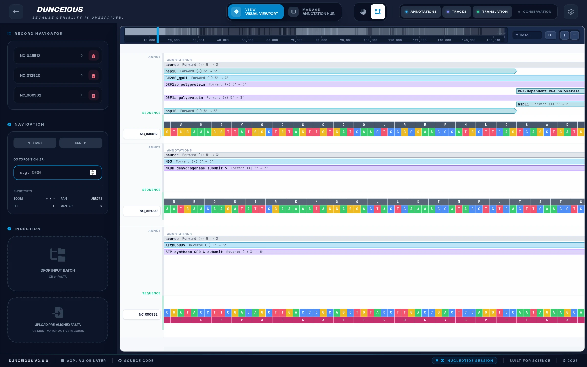

<div align="center">

<a href="https://dunceious.pages.dev/">
  
</a>

<p>
  <a href="https://github.com/JoaoVictorDaijo/dunceious/actions/workflows/ci.yml"></a>
  <a href="./CHANGELOG.md"></a>
  <a href="./COPYING"></a>
</p>

**View, annotate and search GenBank, FASTA and multiple sequence alignments in your browser.**

### [Open Dunceious →](https://dunceious.pages.dev/)

[User manual](./USER_MANUAL.md) · [Architecture](./ARCHITECTURE.md) · [Changelog](./CHANGELOG.md)

</div>



## What it does

- **Load** multi-record GenBank (nucleotide or protein) and FASTA files by picking or dropping them. Repeated IDs are renamed instead of overwritten.
- **Align** by uploading a pre-aligned FASTA from your own tool, or by sending the records to [EMBL-EBI](https://www.ebi.ac.uk/jdispatcher/) (MAFFT, Kalign, Clustal Omega, MUSCLE). Annotations follow the alignment, and a conservation heatmap is drawn.
- **Explore** with semantic zoom, from mismatch density down to bases and amino-acid translations, including the codon shift at programmed ribosomal frameshifts.
- **Search** with IUPAC codes or fuzzy Smith-Waterman matching on both strands, and turn hits into annotations.
- **Annotate**: import GFF3/BED, edit features and qualifiers, and manage everything in the Annotation Hub.
- **Export** FASTA, GFF3, GenBank, a selection as JSON, or the whole project.

Example files to try are in [`examples/`](./examples/README.md).

## How it works

- Everything runs in your browser. Files are parsed and searched in Web Workers on your machine, and there is no backend or account.
- The app is a static site with no third-party CDNs: [dunceious.pages.dev](https://dunceious.pages.dev/) only serves its files and never receives your data.
- The one exception is remote alignment. It asks for your agreement on every page load before sending sequences and an email to EMBL-EBI. If you align with your own tool, nothing leaves your machine.
- Built with React, TypeScript, Vite and D3. The code is split into layers (`domain ← core ← workers ← app`), described in [ARCHITECTURE.md](./ARCHITECTURE.md).

## Run it locally

You only need this to work offline or change the code. Install [Node.js](https://nodejs.org/) 20.19+ or 22.12+ (for example with [nvm](https://github.com/nvm-sh/nvm)), then:

```bash
git clone https://github.com/JoaoVictorDaijo/dunceious.git
cd dunceious
npm ci
npm run dev       # http://localhost:3000
```

`npm run build` makes a production build in `dist/`. Tests, benchmarks and other scripts are listed in [`package.json`](./package.json).

## Contributing

Open pull requests against `develop`; `main` is what gets deployed. Before pushing, run:

```bash
npm run typecheck && npm run lint && npm test && npm run build && npm run lint:headers
```

Source files need the AGPL header (`node scripts/check-license-headers.mjs --fix` adds it). Releases are described in [CLAUDE.md](./CLAUDE.md#versioning--releases).

## License

[AGPL-3.0-or-later](./COPYING). Production builds carry the license as `COPYING.txt` and the bundled dependencies' licenses as `THIRD_PARTY_NOTICES.txt`. The DNA mark is the Font Awesome Free `fa-dna` icon ([CC BY 4.0](https://fontawesome.com/license/free)); the banner lettering is set in [Inter](https://github.com/rsms/inter) ([SIL OFL 1.1](https://openfontlicense.org)).
